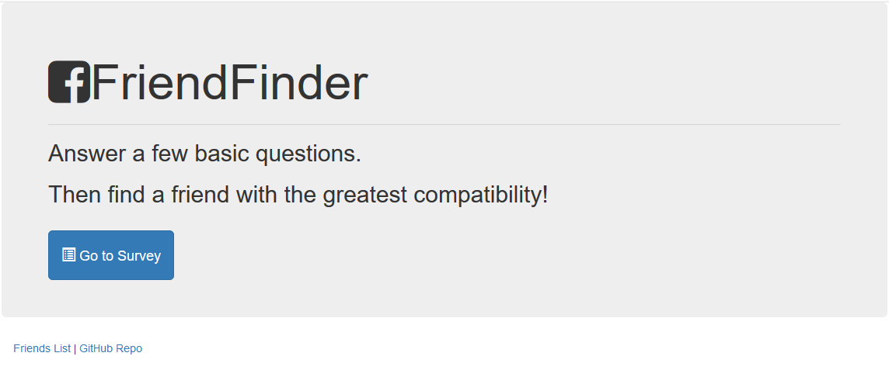
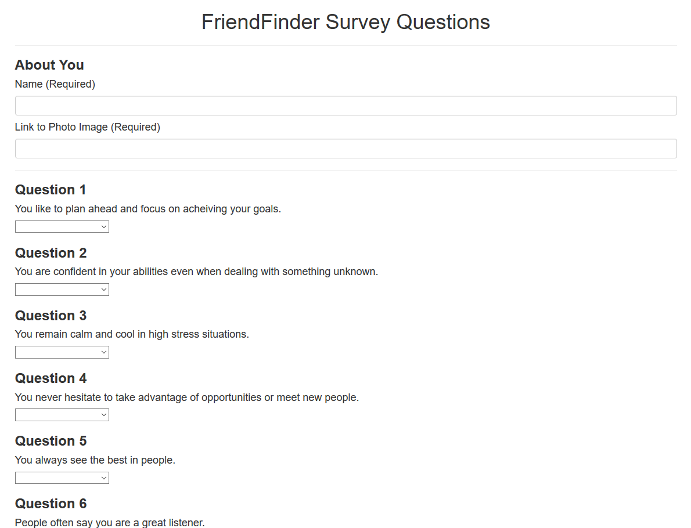

# Friend Finder - Node and Express Servers

### Overview

"FriendFinder" is a compatibility-based application -- basically a dating app. This full-stack site takes in results from users' surveys, and compares their answers with those from other users. The app then displays the name and picture of the user with the best overall match. 

This app uses Express to handle routing and is deployed to Heroku so other users can fill it out.

The survey consists of 10 questions. Each queston is answered on a scale of 1 to 5 based on how much the user agrees or disagrees with a question. 

The app gathers user survey results and then compares them to other users to find the best match.

### Links

* Heroku link: https://stormy-falls-65386.herokuapp.com/
* Github Repo: https://github.com/MV-stack/friendFinder
* Portfolio: https://mv-stack.github.io/Portfolio-EC/

### Screenshots

### Tech

**GitHub** (https://github.com/)
**Heroku** (https://www.heroku.com/)
**Node.js** (https://nodejs.org/en/)
**Express** (https://expressjs.com/)
**Path** (https://nodejs.org/api/path.html)
**Visual Studio Code** (https://code.visualstudio.com/)

